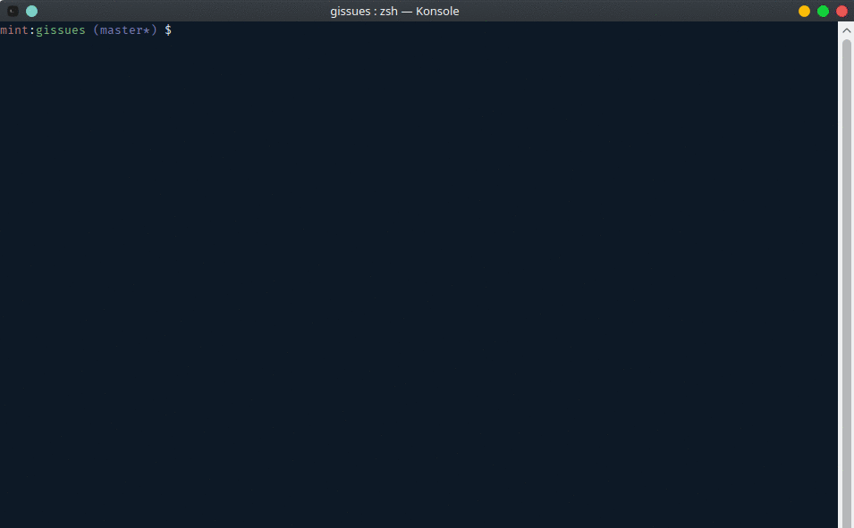

# Gissues

> Display open Github issues sorted by the oldest.

[](https://travis-ci.org/nayed/gissues)
[](http://inch-ci.org/github/nayed/gissues)

## Usage
```
bin/gissues <user> <project> [ count | 4 ]

Options:
-h, --help      show this help message and exit
```



## Installation
Assuming you have [elixir](http://elixir-lang.org) install:
```
git clone https://github.com/nayed/gissues.git
cd gissues
mix deps.get
mix escript.build
```

This will create the `gissues` executable file in the `bin` directory

### Documentation
[API documentation](doc/index.html)
